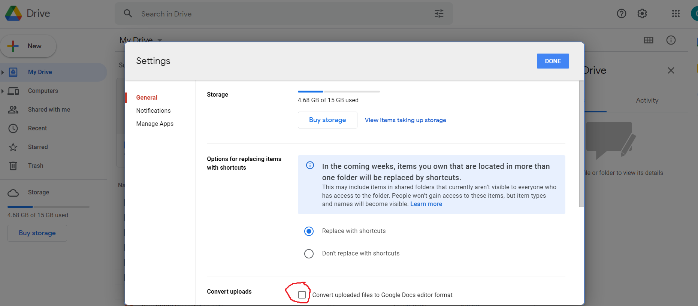

# Autorun
Autorun allows you to send jobs to a remote computer without having to set up a server (like a sane person would normally do). It works as follows (more details under [Usage](#usage)):
1. You create **Input** and **Output** folders on your Google Drive.
2. Users store input files in these **Input** folders
3. This script periodically checks these **Input** folders for files
4. If files are detected, the script downloads the files in the **Input** folder and searches for a script file named `run.sh`.
5. The script file is executed and output is uploaded to the **Output** folder on GDrive

## Setup
1. Clone this repo: `git clone https://github.com/chrismathew05/autorun.git`
2. Create a Google Cloud Project on [GCP](https://console.cloud.google.com/).
3. Enable the [Google Drive API](https://console.cloud.google.com/apis/api/drive.googleapis.com) on your project.
4. Create Credentials > OAuth Client Id > Desktop App. You will be asked to configure an OAuth consent screen first.
5. Download credentials JSON file and rename to `credentials.json`. Drag into the `auth` folder.
6. Run the build script to set up the project:
    - Linux: `./build.sh`. You will have to grant permission first (`chmod +x build.sh`)
    - Windows: TODO
7. Configure the newly created `config.json` with the desired **Input** and **Output** folder ids from GDrive.
8. To ensure proper file conversions, you should uncheck automatic file conversion in your GDrive [settings](https://drive.google.com/drive/settings).



## Usage
Usage is simple:
1. Create your python/matlab script, ensuring that somewhere in the script, output is saved to `../temp/output/`
2. Create a bash script named `run.sh`. This script should install necessary requirements, call the python/matlab script, and uninstall once complete. Example below:
```
#!/bin/bash

# install required packages temporarily to venv
pip install -r temp/input/requirements-new.txt

# run python file
python3 temp/input/test.py

# uninstall packages
yes | pip uninstall -r temp/input/requirements-new.txt
```
3. Upload the above to your GDrive **Input** folder.
4. Run `autorun.sh`. Results should appear in your **Output** folder after execution.

## Documentation
This project is documented with [Sphinx](https://www.sphinx-doc.org/en/master/tutorial/first-steps.html).

## TODO
- Implement email notifications for when jobs finish processing
- Test with Matlab scripts